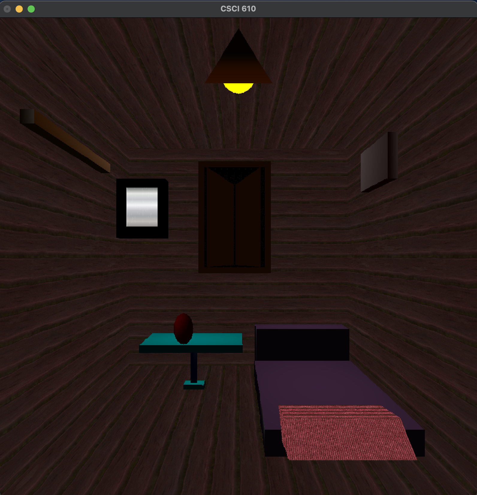

# CGI Room Scene Renderer

This project uses a custom CGI engine to render a 3D room scene with various textured and Phong-shaded objects like walls, bed, pillow, blanket, furniture, mirror, window, and light sources.



## 📸 Overview

The room scene includes:
- **Textured wooden walls**
- **A bed with a blanket and pillow**
- **A table with a plant pot**
- **A mirror with reflective texture**
- **A framed picture**
- **Windows with doors**
- **A ceiling light and bulb**
- **A hanger bar**

Phong shading and texture mapping techniques are used to enhance realism.

---

## 🗂️ Project Structure

```text
.
├── main.py              # Main Python file containing scene setup
├── Wood.jpg             # Texture image for walls
├── Fabric.jpg           # Texture for blanket or cloth
├── mirror.jpg           # Mirror texture
├── rit_window.py        # Handles window setup and display
├── cgi_engine.py        # Core rendering engine with camera, lights, transformations
├── vertex.py            # Vertex structures and utilities
├── clipper.py           # Clipping utility
├── shapes_new.py        # Contains mesh data: cube, sphere, cone, cylinder

```

## 🛠️ Requirements

- Python 3.7+
- [`numpy`](https://pypi.org/project/numpy/)
- [`Pillow`](https://pypi.org/project/Pillow/) (Python Imaging Library)
- Custom rendering engine files (rit_window.py, cgi_engine.py, etc.)

Install the required libraries using:

```bash
pip install numpy pillow
```

## ▶️ How to Run

1. Ensure all required files and textures (`Wood.jpg`, `Fabric.jpg`, `mirror.jpg`) are in the same directory as your Python scripts.
2. Install dependencies.
3. Run the project with:

```bash
python main.py
```
## 🔍 Key Features

- **Camera Setup:** Multiple `setCamera()` calls are used to simulate different viewpoints in the scene.
- **Transform Stack:** Uses `pushTransform()` and `popTransform()` to handle hierarchical object transformations cleanly.
- **Lighting Control:** Dynamic scene lighting with `setLight()` and `setAmbient()` for realism.
- **Shading Techniques:**
  - **Phong Shading**: Applied to most objects for smooth lighting and reflection simulation.
  - **Texture Mapping**: Used for walls, blankets, and mirrors using images like `Wood.jpg`, `Fabric.jpg`, and `mirror.jpg`.
- **Scene Composition:**
  - Custom-built 3D room scene using reusable mesh shapes like cubes, cylinders, spheres, and cones.
  - Lighting effects like bulbs and lamp glow are simulated using both shaded and colored primitives.
- **Software Rendering:** The Entire scene is rendered using a custom Python-based engine—no reliance on OpenGL.

---

## 🎨 Textures Used

Ensure the following image files are present in your project directory:

- `Wood.jpg`: Applied to wall panels to simulate wooden textures.
- `Fabric.jpg`: Used for blanket or pillow textures.
- `mirror.jpg`: Mapped onto a plane to simulate a mirror surface.

All textures are loaded using the `Pillow` (`PIL`) library and passed into the engine via:

```python
from PIL import Image
im = Image.open("Wood.jpg")
```


